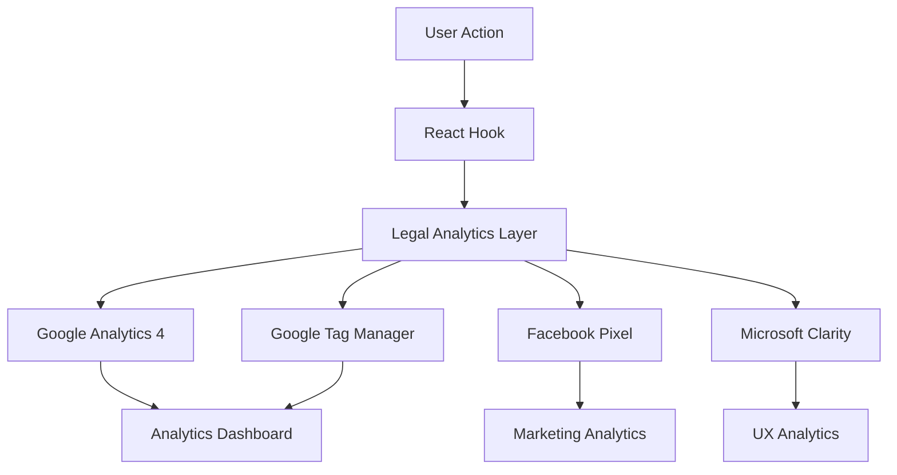

# LexChronos Analytics Implementation Guide

## 🎯 Overview

This guide provides comprehensive documentation for the analytics implementation in LexChronos, a legal case management system. The analytics stack is specifically designed to track legal practice metrics, case progression, client interactions, and business performance.

## 📊 Analytics Stack

### Core Analytics Services

1. **Google Analytics 4 (GA4)**
   - Universal analytics for user behavior tracking
   - Legal-specific event tracking
   - Conversion goal monitoring
   - Enhanced ecommerce for billing

2. **Google Tag Manager (GTM)**
   - Centralized tag management
   - Custom event tracking
   - Data layer implementation
   - Legal practice specific triggers

3. **Facebook Pixel**
   - Marketing campaign tracking
   - Lead generation analytics
   - Client acquisition funnel
   - iOS 14.5+ compliant tracking

4. **Microsoft Clarity**
   - User behavior heatmaps
   - Session recordings
   - Performance monitoring
   - User experience insights

## 🚀 Quick Start

### 1. Environment Setup

Copy `.env.example` to `.env.local` and configure:

```bash
# Required Analytics Configuration
NEXT_PUBLIC_GA_TRACKING_ID=G-XXXXXXXXXX
NEXT_PUBLIC_GTM_ID=GTM-XXXXXXX
NEXT_PUBLIC_FB_PIXEL_ID=000000000000000
NEXT_PUBLIC_CLARITY_PROJECT_ID=xxxxxxxxx

# Legal Practice Configuration
NEXT_PUBLIC_FIRM_NAME="Your Law Firm"
NEXT_PUBLIC_FIRM_ID="your-firm-id"
NEXT_PUBLIC_PRACTICE_AREAS="Corporate Law,Employment Law,Litigation"
```

### 2. Verification

Run the analytics verification script:

```bash
npm run verify-analytics
```

### 3. Dashboard Access

Access the analytics dashboard at `/analytics` in your application.

## 🏗️ Architecture

### File Structure

```
lexchrono/
├── lib/analytics/
│   ├── google-analytics.ts      # GA4 implementation
│   ├── google-tag-manager.ts    # GTM data layer
│   ├── facebook-pixel.ts        # FB Pixel tracking
│   ├── microsoft-clarity.ts     # Clarity integration
│   └── legal-analytics.ts       # Unified tracking system
├── components/analytics/
│   ├── analytics-provider.tsx   # Main provider component
│   └── analytics-dashboard.tsx  # Dashboard UI
├── hooks/
│   └── use-analytics.ts         # React hooks for tracking
└── scripts/
    └── verify-analytics.js      # Verification script
```

### Data Flow



## 📋 Legal-Specific Tracking

### Case Management Events

```typescript
import { useCaseAnalytics } from '@/hooks/use-analytics';

const { trackCaseCreated, trackCaseClosed } = useCaseAnalytics();

// Track case creation
trackCaseCreated({
  case_id: 'case-123',
  case_type: 'Corporate Litigation',
  practice_area: 'Corporate Law',
  client_id: 'client-456',
  estimated_value: 50000,
  priority: 'high',
  status: 'active',
  assigned_attorney: 'attorney-789',
  created_date: new Date()
});

// Track case closure
trackCaseClosed('case-123', 'won', 75000);
```

### Document Management

```typescript
import { useDocumentAnalytics } from '@/hooks/use-analytics';

const { trackDocumentUpload } = useDocumentAnalytics();

trackDocumentUpload({
  document_id: 'doc-123',
  document_type: 'Contract',
  case_id: 'case-123',
  client_id: 'client-456',
  file_size: 1024000,
  upload_method: 'drag_drop'
});
```

### Time Tracking

```typescript
import { useTimeTrackingAnalytics } from '@/hooks/use-analytics';

const { trackTimeEntry } = useTimeTrackingAnalytics();

trackTimeEntry({
  entry_id: 'time-123',
  attorney_id: 'attorney-789',
  case_id: 'case-123',
  activity_type: 'Research',
  minutes: 120,
  billable: true,
  practice_area: 'Corporate Law',
  description: 'Contract review and analysis',
  date: new Date()
});
```

### Billing Analytics

```typescript
import { useBillingAnalytics } from '@/hooks/use-analytics';

const { trackBillingEvent } = useBillingAnalytics();

trackBillingEvent({
  transaction_id: 'txn-123',
  amount: 5000,
  billing_type: 'hourly',
  payment_method: 'credit_card',
  case_id: 'case-123',
  client_id: 'client-456',
  attorney_id: 'attorney-789',
  hours_billed: 10,
  rate: 500
});
```

## 🎨 Dashboard Features

### Key Performance Indicators

- **Revenue Metrics**: Total revenue, revenue by practice area, average case value
- **Case Analytics**: Active cases, case resolution rates, average case duration
- **Client Metrics**: New client acquisition, retention rates, satisfaction scores
- **Time Tracking**: Billable hours, utilization rates, productivity metrics
- **Document Management**: Upload volumes, processing times, storage usage

### Interactive Charts

- Time series analysis of key metrics
- Practice area performance comparison
- Client acquisition funnel visualization
- Case outcome distribution
- Revenue source breakdown

### Legal-Specific Insights

- **Case Win Rates** by practice area and attorney
- **Client Lifetime Value** calculation
- **Billing Efficiency** metrics
- **Court Date Success** tracking
- **Document Turnaround** times

## 🔧 Configuration

### Google Analytics 4 Setup

1. Create GA4 property at https://analytics.google.com/
2. Configure enhanced ecommerce for billing tracking
3. Set up custom dimensions for:
   - Practice Area
   - Case Type
   - Client Tier
   - Attorney ID
   - Billing Type

### Google Tag Manager Setup

1. Create GTM container at https://tagmanager.google.com/
2. Configure triggers for legal events:
   - Case creation/closure
   - Document uploads
   - Time entries
   - Payment processing
   - Client interactions

### Facebook Pixel Configuration

1. Create Facebook Business Manager account
2. Set up Pixel for lead generation tracking
3. Configure custom events for:
   - Consultation bookings
   - Case inquiries
   - Newsletter signups
   - Contact form submissions

### Microsoft Clarity Setup

1. Create Clarity project at https://clarity.microsoft.com/
2. Configure user identification for legal professionals
3. Set up custom tags for:
   - User roles (attorney, paralegal, client)
   - Practice areas
   - Feature usage

## 🔒 Privacy & Compliance

### GDPR Compliance

- Cookie consent management
- Data anonymization for EU users
- Right to deletion implementation
- Privacy policy integration

### CCPA Compliance

- California consumer privacy rights
- Opt-out mechanisms
- Data disclosure tracking

### Legal Professional Ethics

- Client confidentiality protection
- Secure data transmission
- Audit trail maintenance
- Professional responsibility compliance

## 📈 Custom Events Reference

### Case Management Events

- `case_created`: New case initiated
- `case_updated`: Case status/details changed
- `case_closed`: Case resolved or closed
- `case_milestone`: Key case milestone reached

### Document Events

- `document_uploaded`: New document added
- `document_shared`: Document shared with client/court
- `document_reviewed`: Document review completed
- `document_signed`: Electronic signature completed

### Client Interaction Events

- `client_call`: Phone consultation
- `client_meeting`: In-person or virtual meeting
- `client_email`: Email communication
- `client_feedback`: Satisfaction survey response

### Billing Events

- `invoice_generated`: New invoice created
- `payment_received`: Payment processed
- `payment_overdue`: Payment past due
- `retainer_depleted`: Retainer balance low

### Time Tracking Events

- `time_started`: Timer started
- `time_stopped`: Timer stopped
- `time_entry_created`: Manual time entry
- `time_approved`: Time entry approved for billing

## 🧪 Testing

### Development Testing

```bash
# Run analytics verification
npm run verify-analytics

# Test in browser
# Open browser developer tools
# Navigate to Network tab
# Verify analytics requests are sent
```

### Production Validation

1. **Google Analytics**: Check real-time reports
2. **Google Tag Manager**: Use Preview mode
3. **Facebook Pixel**: Use Facebook Pixel Helper extension
4. **Microsoft Clarity**: Check session recordings

## 🚀 Deployment

### Pre-deployment Checklist

- [ ] All environment variables configured
- [ ] Analytics verification script passes
- [ ] Privacy policy updated
- [ ] Cookie consent implemented
- [ ] GDPR/CCPA compliance verified

### Production Setup

1. Update environment variables with production IDs
2. Configure analytics goals and conversions
3. Set up automated alerts for analytics failures
4. Train team on dashboard usage

## 📊 Monitoring & Maintenance

### Regular Tasks

- **Weekly**: Review dashboard metrics
- **Monthly**: Analyze conversion rates and goal performance
- **Quarterly**: Update practice area configurations
- **Annually**: Review privacy compliance and data retention

### Performance Optimization

- Monitor page load impact of analytics scripts
- Implement lazy loading for non-critical tracking
- Use server-side tracking for sensitive data
- Optimize data layer structure

## 🆘 Troubleshooting

### Common Issues

1. **Analytics not loading**
   - Check environment variables
   - Verify network connectivity
   - Check for ad blockers

2. **Events not tracking**
   - Verify event implementation
   - Check browser console for errors
   - Test in incognito mode

3. **Dashboard not displaying data**
   - Check API connectivity
   - Verify authentication tokens
   - Review data processing delays

### Debug Mode

Enable debug mode for detailed logging:

```javascript
window.gtag('config', 'GA_TRACKING_ID', {
  debug_mode: true
});
```

## 📚 Additional Resources

- [Google Analytics 4 for Legal Practices](https://support.google.com/analytics/)
- [Legal Marketing Analytics Best Practices](https://www.americanbar.org/)
- [Privacy Compliance for Law Firms](https://www.legalethics.org/)
- [Legal Technology Analytics Guide](https://www.legaltech.org/)

## 🤝 Support

For questions or issues with the analytics implementation:

1. Check this documentation
2. Run the verification script
3. Review browser console for errors
4. Contact the development team

---

**Last Updated**: August 19, 2025
**Version**: 1.0.0
**Maintainer**: LexChronos Development Team