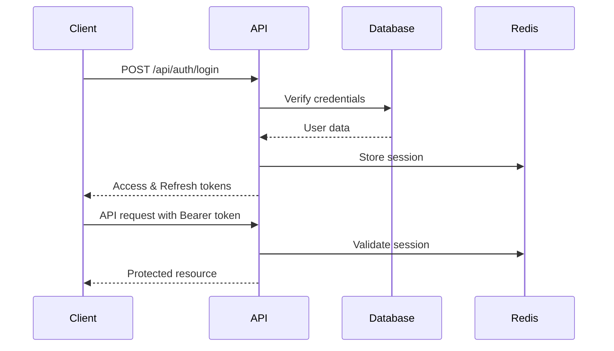

# Authentication API

Complete guide to authentication and authorization in the LexChronos API.

## 📋 Table of Contents

1. [Authentication Overview](#authentication-overview)
2. [JWT Token System](#jwt-token-system)
3. [Login & Registration](#login--registration)
4. [Token Management](#token-management)
5. [Multi-Factor Authentication](#multi-factor-authentication)
6. [Password Management](#password-management)
7. [Session Management](#session-management)
8. [OAuth Integration](#oauth-integration)

## 🔐 Authentication Overview

### Security Standards

LexChronos implements industry-standard authentication:
- **JWT (JSON Web Tokens)** for stateless authentication
- **HTTPS-only** communication in production
- **bcrypt** password hashing with salt rounds
- **Rate limiting** on authentication endpoints
- **Multi-factor authentication** support

### Authentication Flow



## 🎯 JWT Token System

### Token Structure

```typescript
interface JWTPayload {
  userId: string              // User identifier
  organizationId: string      // Organization identifier
  role: UserRole             // User role (ADMIN, LAWYER, etc.)
  permissions: Permission[]   // Specific permissions
  sessionId: string          // Session identifier
  iat: number               // Issued at timestamp
  exp: number               // Expiration timestamp
  iss: string               // Issuer (lexchronos)
  aud: string               // Audience (lexchronos-api)
}
```

### Token Validation

```javascript
// Example token validation
const validateToken = async (token) => {
  try {
    const decoded = jwt.verify(token, process.env.JWT_SECRET)
    
    // Check if session is still valid
    const session = await redis.get(`session:${decoded.sessionId}`)
    if (!session) {
      throw new Error('Session expired')
    }
    
    return decoded
  } catch (error) {
    throw new Error('Invalid token')
  }
}
```

## 🚪 Login & Registration

### User Registration

#### Endpoint
```http
POST /api/auth/register
Content-Type: application/json
```

#### Request Body
```json
{
  "email": "user@example.com",
  "password": "SecurePassword123!",
  "firstName": "John",
  "lastName": "Doe",
  "organizationName": "Smith & Associates",
  "organizationType": "LAW_FIRM",
  "barNumber": "12345",
  "jurisdiction": "NY"
}
```

#### Response (201 Created)
```json
{
  "success": true,
  "data": {
    "user": {
      "id": "user_clx123abc",
      "email": "user@example.com",
      "firstName": "John",
      "lastName": "Doe",
      "role": "LAWYER",
      "organizationId": "org_clx456def",
      "isActive": false,
      "emailVerified": false
    },
    "organization": {
      "id": "org_clx456def",
      "name": "Smith & Associates",
      "type": "LAW_FIRM"
    },
    "message": "Registration successful. Please check your email to verify your account."
  }
}
```

#### Error Responses
```json
// Email already exists (409 Conflict)
{
  "success": false,
  "error": {
    "code": "EMAIL_EXISTS",
    "message": "An account with this email already exists"
  }
}

// Validation error (422 Unprocessable Entity)
{
  "success": false,
  "error": {
    "code": "VALIDATION_ERROR",
    "message": "Invalid input data",
    "details": [
      {
        "field": "password",
        "message": "Password must be at least 8 characters"
      }
    ]
  }
}
```

### User Login

#### Endpoint
```http
POST /api/auth/login
Content-Type: application/json
```

#### Request Body
```json
{
  "email": "user@example.com",
  "password": "SecurePassword123!",
  "rememberMe": true
}
```

#### Response (200 OK)
```json
{
  "success": true,
  "data": {
    "user": {
      "id": "user_clx123abc",
      "email": "user@example.com",
      "firstName": "John",
      "lastName": "Doe",
      "role": "LAWYER",
      "organizationId": "org_clx456def",
      "permissions": [
        "CREATE_CASE",
        "READ_CASE",
        "UPDATE_CASE",
        "UPLOAD_DOCUMENT"
      ]
    },
    "tokens": {
      "accessToken": "eyJhbGciOiJIUzI1NiIsInR5cCI6IkpXVCJ9...",
      "refreshToken": "eyJhbGciOiJIUzI1NiIsInR5cCI6IkpXVCJ9...",
      "expiresIn": 3600,
      "tokenType": "Bearer"
    },
    "session": {
      "id": "session_clx789ghi",
      "expiresAt": "2024-01-16T12:00:00Z"
    }
  }
}
```

#### Error Responses
```json
// Invalid credentials (401 Unauthorized)
{
  "success": false,
  "error": {
    "code": "INVALID_CREDENTIALS",
    "message": "Invalid email or password"
  }
}

// Account locked (423 Locked)
{
  "success": false,
  "error": {
    "code": "ACCOUNT_LOCKED",
    "message": "Account temporarily locked due to multiple failed login attempts",
    "retryAfter": 900
  }
}

// Email not verified (403 Forbidden)
{
  "success": false,
  "error": {
    "code": "EMAIL_NOT_VERIFIED",
    "message": "Please verify your email address before logging in"
  }
}
```

## 🔄 Token Management

### Refresh Token

#### Endpoint
```http
POST /api/auth/refresh
Content-Type: application/json
Authorization: Bearer <refresh_token>
```

#### Request Body
```json
{
  "refreshToken": "eyJhbGciOiJIUzI1NiIsInR5cCI6IkpXVCJ9..."
}
```

#### Response (200 OK)
```json
{
  "success": true,
  "data": {
    "tokens": {
      "accessToken": "eyJhbGciOiJIUzI1NiIsInR5cCI6IkpXVCJ9...",
      "refreshToken": "eyJhbGciOiJIUzI1NiIsInR5cCI6IkpXVCJ9...",
      "expiresIn": 3600,
      "tokenType": "Bearer"
    }
  }
}
```

### Token Validation

#### Endpoint
```http
GET /api/auth/validate
Authorization: Bearer <access_token>
```

#### Response (200 OK)
```json
{
  "success": true,
  "data": {
    "valid": true,
    "user": {
      "id": "user_clx123abc",
      "email": "user@example.com",
      "role": "LAWYER",
      "permissions": ["CREATE_CASE", "READ_CASE"]
    },
    "expiresAt": "2024-01-15T13:00:00Z"
  }
}
```

### Logout

#### Endpoint
```http
POST /api/auth/logout
Authorization: Bearer <access_token>
```

#### Response (200 OK)
```json
{
  "success": true,
  "message": "Successfully logged out"
}
```

#### Logout All Sessions
```http
POST /api/auth/logout/all
Authorization: Bearer <access_token>
```

## 🔐 Multi-Factor Authentication

### Enable MFA

#### Endpoint
```http
POST /api/auth/mfa/enable
Authorization: Bearer <access_token>
```

#### Response (200 OK)
```json
{
  "success": true,
  "data": {
    "secret": "JBSWY3DPEHPK3PXP",
    "qrCode": "data:image/png;base64,iVBORw0KGgoAAAANSUhEUgAA...",
    "backupCodes": [
      "12345678",
      "87654321",
      "11223344",
      "44332211",
      "55667788"
    ]
  }
}
```

### Verify MFA Setup

#### Endpoint
```http
POST /api/auth/mfa/verify-setup
Authorization: Bearer <access_token>
Content-Type: application/json
```

#### Request Body
```json
{
  "token": "123456"
}
```

#### Response (200 OK)
```json
{
  "success": true,
  "data": {
    "mfaEnabled": true,
    "message": "MFA successfully enabled"
  }
}
```

### MFA Login

#### Endpoint
```http
POST /api/auth/mfa/verify
Content-Type: application/json
```

#### Request Body
```json
{
  "sessionToken": "temp_session_token_from_initial_login",
  "token": "123456"
}
```

#### Response (200 OK)
```json
{
  "success": true,
  "data": {
    "tokens": {
      "accessToken": "eyJhbGciOiJIUzI1NiIsInR5cCI6IkpXVCJ9...",
      "refreshToken": "eyJhbGciOiJIUzI1NiIsInR5cCI6IkpXVCJ9...",
      "expiresIn": 3600
    }
  }
}
```

## 🔑 Password Management

### Change Password

#### Endpoint
```http
PUT /api/auth/password
Authorization: Bearer <access_token>
Content-Type: application/json
```

#### Request Body
```json
{
  "currentPassword": "CurrentPassword123!",
  "newPassword": "NewPassword456!",
  "confirmPassword": "NewPassword456!"
}
```

#### Response (200 OK)
```json
{
  "success": true,
  "message": "Password successfully changed"
}
```

### Forgot Password

#### Endpoint
```http
POST /api/auth/forgot-password
Content-Type: application/json
```

#### Request Body
```json
{
  "email": "user@example.com"
}
```

#### Response (200 OK)
```json
{
  "success": true,
  "message": "If an account with this email exists, a password reset link has been sent"
}
```

### Reset Password

#### Endpoint
```http
POST /api/auth/reset-password
Content-Type: application/json
```

#### Request Body
```json
{
  "token": "reset_token_from_email",
  "password": "NewPassword789!",
  "confirmPassword": "NewPassword789!"
}
```

#### Response (200 OK)
```json
{
  "success": true,
  "message": "Password successfully reset"
}
```

## 📱 Session Management

### Get Active Sessions

#### Endpoint
```http
GET /api/auth/sessions
Authorization: Bearer <access_token>
```

#### Response (200 OK)
```json
{
  "success": true,
  "data": {
    "sessions": [
      {
        "id": "session_clx789ghi",
        "deviceInfo": {
          "userAgent": "Mozilla/5.0 (Windows NT 10.0; Win64; x64) AppleWebKit/537.36",
          "browser": "Chrome",
          "os": "Windows",
          "device": "Desktop"
        },
        "ipAddress": "192.168.1.100",
        "location": {
          "country": "United States",
          "region": "New York",
          "city": "New York"
        },
        "isCurrent": true,
        "createdAt": "2024-01-15T10:00:00Z",
        "lastActivity": "2024-01-15T12:00:00Z",
        "expiresAt": "2024-01-16T12:00:00Z"
      }
    ]
  }
}
```

### Revoke Session

#### Endpoint
```http
DELETE /api/auth/sessions/{sessionId}
Authorization: Bearer <access_token>
```

#### Response (200 OK)
```json
{
  "success": true,
  "message": "Session successfully revoked"
}
```

## 🔗 OAuth Integration

### Google OAuth

#### Initiate OAuth Flow
```http
GET /api/auth/oauth/google
```

#### Callback Handler
```http
GET /api/auth/oauth/google/callback?code=auth_code&state=random_state
```

#### Response (200 OK)
```json
{
  "success": true,
  "data": {
    "user": {
      "id": "user_clx123abc",
      "email": "user@gmail.com",
      "firstName": "John",
      "lastName": "Doe",
      "provider": "google"
    },
    "tokens": {
      "accessToken": "eyJhbGciOiJIUzI1NiIsInR5cCI6IkpXVCJ9...",
      "refreshToken": "eyJhbGciOiJIUzI1NiIsInR5cCI6IkpXVCJ9...",
      "expiresIn": 3600
    }
  }
}
```

### Microsoft OAuth

#### Initiate OAuth Flow
```http
GET /api/auth/oauth/microsoft
```

#### Link Account
```http
POST /api/auth/oauth/link
Authorization: Bearer <access_token>
Content-Type: application/json
```

#### Request Body
```json
{
  "provider": "microsoft",
  "accessToken": "oauth_access_token"
}
```

## 🔒 Security Features

### Rate Limiting

Authentication endpoints are protected by rate limiting:

| Endpoint | Limit | Window |
|----------|-------|---------|
| `/api/auth/login` | 5 attempts | 15 minutes |
| `/api/auth/register` | 3 attempts | 60 minutes |
| `/api/auth/forgot-password` | 3 attempts | 60 minutes |
| `/api/auth/refresh` | 10 attempts | 15 minutes |

### Account Lockout

- **Failed login attempts**: Account locked after 5 failed attempts
- **Lockout duration**: 15 minutes for first lockout, increasing exponentially
- **Unlock methods**: Time-based automatic unlock or admin intervention

### Security Headers

All authentication responses include security headers:
```http
Strict-Transport-Security: max-age=31536000; includeSubDomains
X-Content-Type-Options: nosniff
X-Frame-Options: DENY
X-XSS-Protection: 1; mode=block
```

## 📊 Error Codes Reference

| Code | HTTP Status | Description |
|------|-------------|-------------|
| `INVALID_CREDENTIALS` | 401 | Email or password incorrect |
| `EMAIL_EXISTS` | 409 | Email already registered |
| `EMAIL_NOT_VERIFIED` | 403 | Email verification required |
| `ACCOUNT_LOCKED` | 423 | Account temporarily locked |
| `TOKEN_EXPIRED` | 401 | JWT token has expired |
| `TOKEN_INVALID` | 401 | JWT token is malformed |
| `SESSION_EXPIRED` | 401 | Session no longer valid |
| `MFA_REQUIRED` | 401 | Multi-factor authentication required |
| `MFA_INVALID` | 401 | Invalid MFA token |
| `PASSWORD_WEAK` | 422 | Password doesn't meet requirements |
| `RATE_LIMITED` | 429 | Too many requests |

## 🛠️ SDK Examples

### JavaScript/TypeScript

```typescript
import { LexChronosAuth } from '@lexchronos/sdk'

const auth = new LexChronosAuth({
  baseURL: 'https://api.lexchronos.com'
})

// Login
const { user, tokens } = await auth.login({
  email: 'user@example.com',
  password: 'password'
})

// Store tokens securely
localStorage.setItem('accessToken', tokens.accessToken)
localStorage.setItem('refreshToken', tokens.refreshToken)

// Use tokens for API calls
auth.setAccessToken(tokens.accessToken)
```

### Python

```python
from lexchronos import LexChronosAuth

auth = LexChronosAuth(base_url='https://api.lexchronos.com')

# Login
result = auth.login(
    email='user@example.com',
    password='password'
)

# Store tokens
access_token = result['tokens']['accessToken']
refresh_token = result['tokens']['refreshToken']
```

This authentication system provides robust security while maintaining ease of use for legal professionals.