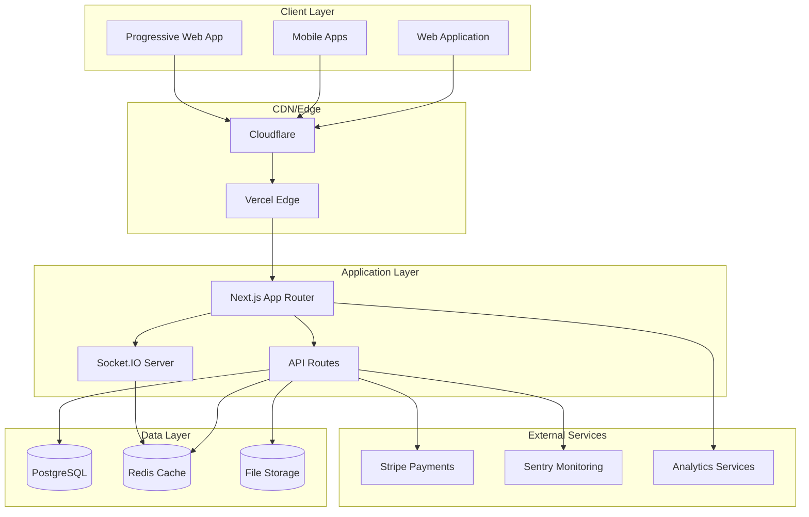
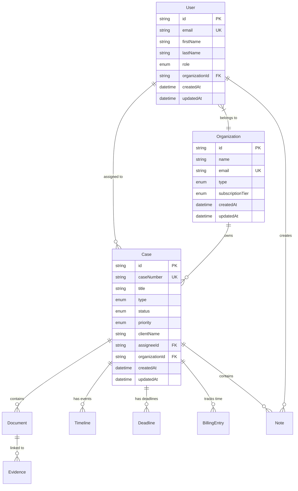
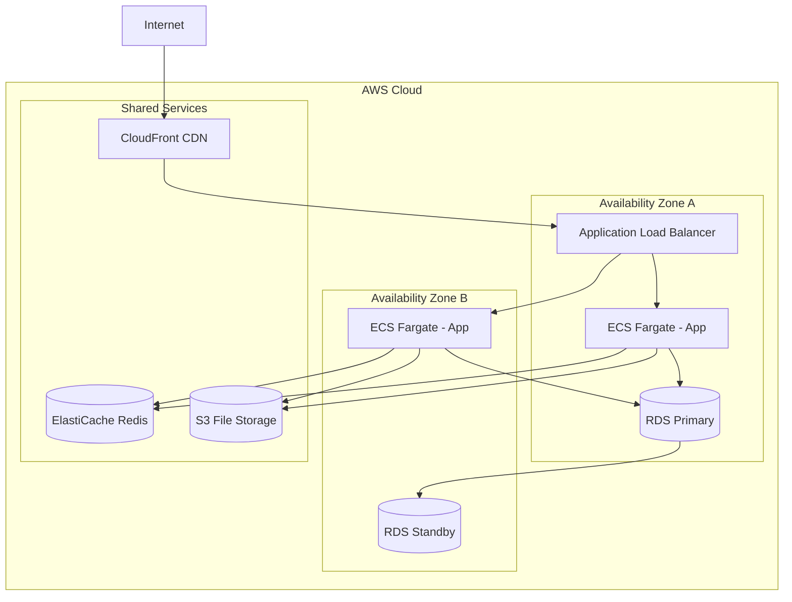

# System Architecture Guide

Comprehensive overview of LexChronos architecture, design patterns, and technical decisions.

## 📋 Table of Contents

1. [High-Level Architecture](#high-level-architecture)
2. [Frontend Architecture](#frontend-architecture)
3. [Backend Architecture](#backend-architecture)
4. [Database Design](#database-design)
5. [Real-Time Communication](#real-time-communication)
6. [Security Architecture](#security-architecture)
7. [Deployment Architecture](#deployment-architecture)
8. [Design Patterns](#design-patterns)

## 🏗️ High-Level Architecture

### System Overview



### Core Principles

**1. Zero Trust Security**
- Every request authenticated and authorized
- End-to-end encryption for sensitive data
- Principle of least privilege

**2. Mobile-First Design**
- Responsive design for all screen sizes
- Progressive Web App capabilities
- Native mobile app support

**3. Real-Time Collaboration**
- Live document editing
- Instant messaging and presence
- Event-driven architecture

**4. Scalable Architecture**
- Microservices-ready design
- Horizontal scaling capabilities
- Multi-tenant architecture

## 🎨 Frontend Architecture

### Technology Stack

```typescript
// Core Framework
Next.js 14+ (App Router)
React 18+
TypeScript 5+

// Styling & UI
Tailwind CSS 4
Radix UI Components
Lucide React Icons

// State Management
Zustand (Global State)
React Query (Server State)
React Hook Form (Form State)

// Real-Time
Socket.IO Client
WebSocket connections
```

### Directory Structure

```
app/
├── (auth)/                    # Authentication routes
│   ├── login/
│   └── register/
├── (dashboard)/               # Protected dashboard routes
│   ├── cases/
│   ├── calendar/
│   ├── documents/
│   └── timeline/
├── api/                       # API routes
│   ├── auth/
│   ├── cases/
│   ├── documents/
│   └── webhooks/
├── globals.css                # Global styles
├── layout.tsx                 # Root layout
└── page.tsx                   # Home page

components/
├── ui/                        # Reusable UI components
│   ├── button.tsx
│   ├── card.tsx
│   └── input.tsx
├── forms/                     # Form components
├── modals/                    # Modal components
└── navigation.tsx             # Navigation components

hooks/                         # Custom React hooks
├── useAuth.ts
├── useSocket.ts
├── useCaseUpdates.ts
└── useDocumentCollaboration.ts

lib/                           # Utility libraries
├── auth/
├── database/
├── security/
├── validation/
└── utils.ts

types/                         # TypeScript type definitions
├── auth.ts
├── case.ts
└── api.ts
```

### Component Architecture

**1. Compound Components Pattern**
```typescript
// Example: Case management components
<Case.Container>
  <Case.Header>
    <Case.Title />
    <Case.Status />
    <Case.Actions />
  </Case.Header>
  <Case.Content>
    <Case.Details />
    <Case.Timeline />
    <Case.Documents />
  </Case.Content>
</Case.Container>
```

**2. Hook-Based Logic**
```typescript
// Custom hooks for business logic
function useCase(caseId: string) {
  const { data, isLoading, error } = useQuery({
    queryKey: ['case', caseId],
    queryFn: () => fetchCase(caseId)
  })
  
  const updateCase = useMutation({
    mutationFn: updateCaseData,
    onSuccess: () => queryClient.invalidateQueries(['case', caseId])
  })
  
  return { case: data, isLoading, error, updateCase }
}
```

**3. Context Providers**
```typescript
// Global state management
export const AppProviders = ({ children }) => (
  <QueryClientProvider client={queryClient}>
    <AuthProvider>
      <SocketProvider>
        <ThemeProvider>
          {children}
        </ThemeProvider>
      </SocketProvider>
    </AuthProvider>
  </QueryClientProvider>
)
```

### State Management Strategy

**1. Server State (React Query)**
- API data caching
- Background refetching
- Optimistic updates
- Error handling

**2. Client State (Zustand)**
- Authentication state
- UI preferences
- Form state
- Real-time data

**3. Form State (React Hook Form)**
- Form validation
- Error handling
- Performance optimization

## ⚙️ Backend Architecture

### API Architecture

```typescript
// Next.js API Routes structure
app/api/
├── auth/
│   ├── login/route.ts
│   ├── register/route.ts
│   └── refresh/route.ts
├── cases/
│   ├── route.ts              # GET /api/cases, POST /api/cases
│   └── [id]/
│       ├── route.ts          # GET /api/cases/:id, PUT /api/cases/:id
│       ├── documents/route.ts
│       └── timeline/route.ts
├── documents/
│   ├── route.ts
│   ├── upload/route.ts
│   └── [id]/
│       ├── route.ts
│       └── download/route.ts
└── webhooks/
    └── stripe/route.ts
```

### Service Layer Pattern

```typescript
// Service layer for business logic
class CaseService {
  private prisma = new PrismaClient()
  
  async createCase(data: CreateCaseData, userId: string): Promise<Case> {
    // Validation
    const validatedData = await CaseSchema.parseAsync(data)
    
    // Authorization check
    await this.verifyUserPermissions(userId, 'CREATE_CASE')
    
    // Business logic
    const caseNumber = await this.generateCaseNumber()
    
    // Database transaction
    return await this.prisma.$transaction(async (tx) => {
      const newCase = await tx.case.create({
        data: {
          ...validatedData,
          caseNumber,
          assigneeId: userId
        }
      })
      
      // Create initial timeline entry
      await tx.timeline.create({
        data: {
          caseId: newCase.id,
          title: 'Case Created',
          eventType: 'GENERAL',
          eventDate: new Date(),
          createdById: userId
        }
      })
      
      return newCase
    })
  }
}
```

### Middleware Architecture

```typescript
// API middleware chain
export async function middleware(request: NextRequest) {
  // Security headers
  const response = NextResponse.next()
  response.headers.set('X-Frame-Options', 'DENY')
  response.headers.set('X-Content-Type-Options', 'nosniff')
  
  // Authentication
  if (request.nextUrl.pathname.startsWith('/api/')) {
    const token = request.headers.get('authorization')
    if (!token) {
      return new Response('Unauthorized', { status: 401 })
    }
    
    try {
      const payload = await verifyJWT(token)
      request.headers.set('x-user-id', payload.userId)
    } catch {
      return new Response('Invalid token', { status: 401 })
    }
  }
  
  // Rate limiting
  const rateLimitResult = await rateLimit(request)
  if (rateLimitResult.blocked) {
    return new Response('Rate limit exceeded', { status: 429 })
  }
  
  return response
}
```

### WebSocket Architecture

```javascript
// Socket.IO server setup
const io = new Server(httpServer, {
  cors: {
    origin: process.env.SOCKET_IO_CORS_ORIGIN,
    credentials: true
  }
})

// Authentication middleware
io.use(async (socket, next) => {
  try {
    const token = socket.handshake.auth.token
    const payload = await verifyJWT(token)
    socket.userId = payload.userId
    socket.organizationId = payload.organizationId
    next()
  } catch (err) {
    next(new Error('Authentication error'))
  }
})

// Connection handling
io.on('connection', (socket) => {
  console.log(`User ${socket.userId} connected`)
  
  // Join user to their organization room
  socket.join(`org:${socket.organizationId}`)
  
  // Handle case-specific events
  socket.on('case:join', (caseId) => {
    // Verify access to case
    if (hasAccessToCase(socket.userId, caseId)) {
      socket.join(`case:${caseId}`)
    }
  })
  
  // Handle document collaboration
  socket.on('document:edit', (data) => {
    socket.to(`document:${data.documentId}`).emit('document:updated', data)
  })
})
```

## 🗄️ Database Design

### Entity Relationship Model



### Data Access Patterns

**1. Repository Pattern**
```typescript
interface CaseRepository {
  findById(id: string): Promise<Case | null>
  findByOrganization(orgId: string): Promise<Case[]>
  create(data: CreateCaseData): Promise<Case>
  update(id: string, data: UpdateCaseData): Promise<Case>
  delete(id: string): Promise<void>
}

class PrismaCaseRepository implements CaseRepository {
  private prisma = new PrismaClient()
  
  async findById(id: string): Promise<Case | null> {
    return this.prisma.case.findUnique({
      where: { id },
      include: {
        assignee: true,
        organization: true,
        documents: true,
        timelines: true
      }
    })
  }
}
```

**2. Query Optimization**
```typescript
// Efficient queries with proper indexing
const cases = await prisma.case.findMany({
  where: {
    organizationId,
    status: 'ACTIVE'
  },
  include: {
    assignee: {
      select: { id: true, firstName: true, lastName: true }
    },
    _count: {
      select: { documents: true, timelines: true }
    }
  },
  orderBy: { updatedAt: 'desc' },
  take: 20,
  skip: page * 20
})
```

**3. Transaction Management**
```typescript
// Complex operations with transactions
await prisma.$transaction(async (tx) => {
  // Create case
  const newCase = await tx.case.create({ data: caseData })
  
  // Create initial timeline
  await tx.timeline.create({
    data: {
      caseId: newCase.id,
      title: 'Case Created',
      eventType: 'GENERAL',
      eventDate: new Date()
    }
  })
  
  // Update user statistics
  await tx.user.update({
    where: { id: userId },
    data: { totalCases: { increment: 1 } }
  })
})
```

## 🔄 Real-Time Communication

### WebSocket Event System

```typescript
// Event types and handlers
interface SocketEvents {
  // Case events
  'case:join': (caseId: string) => void
  'case:leave': (caseId: string) => void
  'case:update': (data: CaseUpdateData) => void
  'case:updated': (case: Case) => void
  
  // Document collaboration
  'document:join': (documentId: string) => void
  'document:edit': (edit: DocumentEdit) => void
  'document:cursor': (cursor: CursorPosition) => void
  
  // Notifications
  'notification:new': (notification: Notification) => void
  'notification:read': (notificationId: string) => void
  
  // Presence
  'presence:update': (status: PresenceStatus) => void
  'user:online': (userId: string) => void
  'user:offline': (userId: string) => void
}

// Event handling with validation
socket.on('case:update', async (data) => {
  // Validate input
  const validatedData = CaseUpdateSchema.parse(data)
  
  // Check permissions
  if (!await hasPermission(socket.userId, 'UPDATE_CASE', data.caseId)) {
    socket.emit('error', { message: 'Permission denied' })
    return
  }
  
  // Update database
  const updatedCase = await updateCase(data.caseId, validatedData)
  
  // Broadcast to case room
  socket.to(`case:${data.caseId}`).emit('case:updated', updatedCase)
})
```

### Event Sourcing Pattern

```typescript
// Event store for audit trail
interface DomainEvent {
  id: string
  aggregateId: string
  eventType: string
  eventData: any
  timestamp: Date
  userId: string
}

class EventStore {
  async append(event: DomainEvent): Promise<void> {
    await this.prisma.domainEvent.create({
      data: event
    })
    
    // Publish to subscribers
    this.eventBus.publish(event)
  }
  
  async getEvents(aggregateId: string): Promise<DomainEvent[]> {
    return this.prisma.domainEvent.findMany({
      where: { aggregateId },
      orderBy: { timestamp: 'asc' }
    })
  }
}
```

## 🔐 Security Architecture

### Authentication & Authorization

```typescript
// JWT-based authentication
interface JWTPayload {
  userId: string
  organizationId: string
  role: UserRole
  permissions: Permission[]
  exp: number
  iat: number
}

// Permission-based authorization
class AuthorizationService {
  async hasPermission(
    userId: string, 
    permission: Permission, 
    resourceId?: string
  ): Promise<boolean> {
    const user = await this.getUserWithPermissions(userId)
    
    // Check role-based permissions
    if (user.role.permissions.includes(permission)) {
      return true
    }
    
    // Check resource-specific permissions
    if (resourceId) {
      return this.hasResourcePermission(userId, permission, resourceId)
    }
    
    return false
  }
}
```

### Data Encryption

```typescript
// Field-level encryption for sensitive data
class EncryptionService {
  private readonly algorithm = 'aes-256-gcm'
  private readonly key: Buffer
  
  encrypt(plaintext: string): EncryptedData {
    const iv = crypto.randomBytes(16)
    const cipher = crypto.createCipher(this.algorithm, this.key, iv)
    
    let ciphertext = cipher.update(plaintext, 'utf8', 'hex')
    ciphertext += cipher.final('hex')
    
    const tag = cipher.getAuthTag()
    
    return {
      ciphertext,
      iv: iv.toString('hex'),
      tag: tag.toString('hex')
    }
  }
  
  decrypt(encrypted: EncryptedData): string {
    const decipher = crypto.createDecipher(
      this.algorithm, 
      this.key, 
      Buffer.from(encrypted.iv, 'hex')
    )
    
    decipher.setAuthTag(Buffer.from(encrypted.tag, 'hex'))
    
    let plaintext = decipher.update(encrypted.ciphertext, 'hex', 'utf8')
    plaintext += decipher.final('utf8')
    
    return plaintext
  }
}
```

### Security Middleware

```typescript
// Security middleware stack
export const securityMiddleware = [
  helmet(), // Security headers
  cors(corsOptions), // CORS configuration
  rateLimit({
    windowMs: 15 * 60 * 1000, // 15 minutes
    max: 100 // limit each IP to 100 requests per windowMs
  }),
  authenticationMiddleware,
  authorizationMiddleware,
  auditLoggingMiddleware
]
```

## 🚀 Deployment Architecture

### Infrastructure as Code

```yaml
# docker-compose.production.yml
version: '3.8'

services:
  app:
    image: lexchrono:latest
    ports:
      - "3000:3000"
    environment:
      - NODE_ENV=production
      - DATABASE_URL=${DATABASE_URL}
      - REDIS_URL=${REDIS_URL}
    depends_on:
      - postgres
      - redis
    restart: unless-stopped
    
  postgres:
    image: postgres:14
    environment:
      - POSTGRES_DB=${POSTGRES_DB}
      - POSTGRES_USER=${POSTGRES_USER}
      - POSTGRES_PASSWORD=${POSTGRES_PASSWORD}
    volumes:
      - postgres_data:/var/lib/postgresql/data
    restart: unless-stopped
    
  redis:
    image: redis:7-alpine
    restart: unless-stopped
    
  nginx:
    image: nginx:alpine
    ports:
      - "80:80"
      - "443:443"
    volumes:
      - ./nginx.conf:/etc/nginx/nginx.conf
      - ./ssl:/etc/nginx/ssl
    depends_on:
      - app
    restart: unless-stopped

volumes:
  postgres_data:
```

### Cloud Architecture (AWS Example)



## 🎯 Design Patterns

### Domain-Driven Design

```typescript
// Domain entities
class Case {
  private constructor(
    private readonly id: CaseId,
    private readonly caseNumber: CaseNumber,
    private title: string,
    private status: CaseStatus,
    private assigneeId?: UserId
  ) {}
  
  static create(data: CreateCaseData): Case {
    // Domain validation
    if (!data.title || data.title.length < 3) {
      throw new Error('Case title must be at least 3 characters')
    }
    
    return new Case(
      CaseId.generate(),
      CaseNumber.generate(),
      data.title,
      CaseStatus.ACTIVE,
      data.assigneeId
    )
  }
  
  assignTo(userId: UserId): void {
    // Business rules
    if (this.status === CaseStatus.CLOSED) {
      throw new Error('Cannot assign closed case')
    }
    
    this.assigneeId = userId
    
    // Domain event
    DomainEvents.raise(new CaseAssignedEvent(this.id, userId))
  }
}
```

### Command Query Responsibility Segregation (CQRS)

```typescript
// Command side - writes
class CreateCaseCommand {
  constructor(
    public readonly title: string,
    public readonly clientName: string,
    public readonly assigneeId: string
  ) {}
}

class CreateCaseHandler {
  async handle(command: CreateCaseCommand): Promise<CaseId> {
    const case = Case.create({
      title: command.title,
      clientName: command.clientName,
      assigneeId: command.assigneeId
    })
    
    await this.caseRepository.save(case)
    
    return case.id
  }
}

// Query side - reads
class CaseListQuery {
  constructor(
    public readonly organizationId: string,
    public readonly filters: CaseFilters,
    public readonly pagination: Pagination
  ) {}
}

class CaseListQueryHandler {
  async handle(query: CaseListQuery): Promise<CaseListResult> {
    return this.caseReadModel.findCases(
      query.organizationId,
      query.filters,
      query.pagination
    )
  }
}
```

### Event-Driven Architecture

```typescript
// Event bus implementation
class EventBus {
  private handlers = new Map<string, EventHandler[]>()
  
  subscribe<T extends DomainEvent>(
    eventType: string, 
    handler: EventHandler<T>
  ): void {
    if (!this.handlers.has(eventType)) {
      this.handlers.set(eventType, [])
    }
    this.handlers.get(eventType)!.push(handler)
  }
  
  async publish<T extends DomainEvent>(event: T): Promise<void> {
    const handlers = this.handlers.get(event.constructor.name) || []
    
    await Promise.all(
      handlers.map(handler => handler.handle(event))
    )
  }
}

// Event handlers
class CaseAssignedEventHandler {
  async handle(event: CaseAssignedEvent): Promise<void> {
    // Send notification
    await this.notificationService.send({
      userId: event.assigneeId,
      type: 'CASE_ASSIGNED',
      message: `You have been assigned to case ${event.caseId}`
    })
    
    // Update analytics
    await this.analyticsService.track('case_assigned', {
      caseId: event.caseId,
      assigneeId: event.assigneeId
    })
  }
}
```

## 📊 Performance Considerations

### Caching Strategy

```typescript
// Multi-layer caching
class CacheService {
  // Redis for shared cache
  private redis = new Redis(process.env.REDIS_URL)
  
  // In-memory cache for hot data
  private memoryCache = new LRU({ max: 1000, ttl: 300000 })
  
  async get<T>(key: string): Promise<T | null> {
    // Try memory cache first
    let value = this.memoryCache.get(key)
    if (value) return value
    
    // Try Redis cache
    const redisValue = await this.redis.get(key)
    if (redisValue) {
      value = JSON.parse(redisValue)
      this.memoryCache.set(key, value)
      return value
    }
    
    return null
  }
  
  async set(key: string, value: any, ttl: number = 3600): Promise<void> {
    this.memoryCache.set(key, value)
    await this.redis.setex(key, ttl, JSON.stringify(value))
  }
}
```

### Database Optimization

```sql
-- Optimized indexes for common queries
CREATE INDEX CONCURRENTLY idx_cases_org_status ON cases(organization_id, status);
CREATE INDEX CONCURRENTLY idx_documents_case_category ON documents(case_id, category);
CREATE INDEX CONCURRENTLY idx_timelines_case_date ON timelines(case_id, event_date);

-- Partial indexes for filtered queries
CREATE INDEX CONCURRENTLY idx_cases_active 
ON cases(organization_id, updated_at) 
WHERE status = 'ACTIVE';

-- Full-text search indexes
CREATE INDEX CONCURRENTLY idx_cases_search 
ON cases USING gin(to_tsvector('english', title || ' ' || description));
```

This architecture provides a solid foundation for a scalable, secure, and maintainable legal case management platform. The modular design allows for easy testing, deployment, and future enhancements.