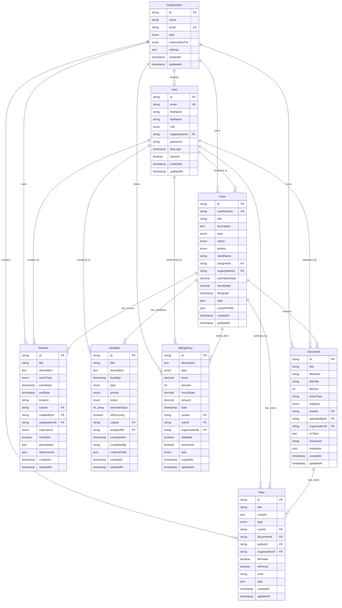

# Database Schema Documentation

Complete reference for the LexChronos database schema, relationships, and design decisions.

## 📋 Table of Contents

1. [Schema Overview](#schema-overview)
2. [Core Entities](#core-entities)
3. [Relationships](#relationships)
4. [Indexes and Performance](#indexes-and-performance)
5. [Data Types and Constraints](#data-types-and-constraints)
6. [Migration Strategy](#migration-strategy)
7. [Best Practices](#best-practices)

## 🗄️ Schema Overview

### Database Technology
- **Primary Database**: PostgreSQL 14+
- **ORM**: Prisma 5.x
- **Cache Layer**: Redis 6+
- **Search**: PostgreSQL Full-Text Search + Optional Elasticsearch

### Design Principles

1. **Normalized Design**: Minimize data redundancy while maintaining performance
2. **Audit Trail**: Complete history tracking for legal compliance
3. **Soft Deletes**: Preserve data integrity with logical deletion
4. **Multi-Tenancy**: Organization-based data isolation
5. **Extensibility**: Support for custom fields and future features

### Entity Relationship Diagram



## 🏢 Core Entities

### Organizations

**Purpose**: Represents law firms, legal departments, or solo practices.

```sql
CREATE TABLE organizations (
    id                TEXT PRIMARY KEY DEFAULT gen_random_uuid(),
    name              TEXT NOT NULL,
    type              organization_type NOT NULL DEFAULT 'LAW_FIRM',
    email             TEXT UNIQUE NOT NULL,
    phone             TEXT,
    website           TEXT,
    
    -- Address
    address           TEXT,
    city              TEXT,
    state             TEXT,
    zip_code          TEXT,
    country           TEXT NOT NULL DEFAULT 'US',
    
    -- Legal Information
    tax_id            TEXT UNIQUE,
    bar_association   TEXT,
    license           TEXT,
    
    -- Subscription
    subscription_tier subscription_tier NOT NULL DEFAULT 'BASIC',
    billing_email     TEXT,
    
    -- Settings
    is_active         BOOLEAN NOT NULL DEFAULT true,
    settings          JSONB,
    
    -- Audit
    created_at        TIMESTAMP WITH TIME ZONE NOT NULL DEFAULT NOW(),
    updated_at        TIMESTAMP WITH TIME ZONE NOT NULL DEFAULT NOW()
);
```

**Key Features:**
- Multi-tenant isolation via `organizationId`
- Flexible settings storage with JSON
- Support for different organization types
- Billing and subscription management

### Users

**Purpose**: Represents individuals within organizations (attorneys, paralegals, etc.).

```sql
CREATE TABLE users (
    id              TEXT PRIMARY KEY DEFAULT gen_random_uuid(),
    email           TEXT UNIQUE NOT NULL,
    first_name      TEXT NOT NULL,
    last_name       TEXT NOT NULL,
    full_name       TEXT GENERATED ALWAYS AS (first_name || ' ' || last_name) STORED,
    role            user_role NOT NULL DEFAULT 'LAWYER',
    is_active       BOOLEAN NOT NULL DEFAULT true,
    timezone        TEXT NOT NULL DEFAULT 'UTC',
    
    -- Authentication
    password        TEXT,
    last_login      TIMESTAMP WITH TIME ZONE,
    
    -- Profile
    phone           TEXT,
    title           TEXT,
    bar_number      TEXT,
    biography       TEXT,
    avatar          TEXT,
    
    -- Organization
    organization_id TEXT REFERENCES organizations(id) ON DELETE CASCADE,
    
    -- Audit
    created_at      TIMESTAMP WITH TIME ZONE NOT NULL DEFAULT NOW(),
    updated_at      TIMESTAMP WITH TIME ZONE NOT NULL DEFAULT NOW()
);
```

**Key Features:**
- Role-based access control
- Generated full name for search
- Optional authentication (supports SSO)
- Rich profile information

### Cases

**Purpose**: Central entity representing legal cases.

```sql
CREATE TABLE cases (
    id                     TEXT PRIMARY KEY DEFAULT gen_random_uuid(),
    case_number            TEXT UNIQUE NOT NULL,
    title                  TEXT NOT NULL,
    description            TEXT,
    type                   case_type NOT NULL DEFAULT 'CIVIL',
    status                 case_status NOT NULL DEFAULT 'ACTIVE',
    priority               priority_level NOT NULL DEFAULT 'MEDIUM',
    
    -- Client Information
    client_name            TEXT NOT NULL,
    client_email           TEXT,
    client_phone           TEXT,
    client_address         TEXT,
    
    -- Case Details
    court                  TEXT,
    judge                  TEXT,
    opposing_party         TEXT,
    opposing_counsel       TEXT,
    
    -- Dates
    filing_date            TIMESTAMP WITH TIME ZONE,
    start_date             TIMESTAMP WITH TIME ZONE NOT NULL DEFAULT NOW(),
    close_date             TIMESTAMP WITH TIME ZONE,
    statute_of_limitations TIMESTAMP WITH TIME ZONE,
    
    -- Financial
    estimated_value        DECIMAL(12,2),
    contingency_fee        DECIMAL(5,2),
    hourly_rate           DECIMAL(8,2),
    
    -- Relationships
    organization_id        TEXT NOT NULL REFERENCES organizations(id) ON DELETE CASCADE,
    assignee_id           TEXT REFERENCES users(id),
    
    -- Metadata
    tags                  JSONB,
    custom_fields         JSONB,
    
    -- Audit
    created_at            TIMESTAMP WITH TIME ZONE NOT NULL DEFAULT NOW(),
    updated_at            TIMESTAMP WITH TIME ZONE NOT NULL DEFAULT NOW()
);
```

**Key Features:**
- Flexible case typing and status tracking
- Comprehensive client information
- Financial tracking capabilities
- Extensible via custom fields and tags

### Documents

**Purpose**: File storage and management with OCR and categorization.

```sql
CREATE TABLE documents (
    id              TEXT PRIMARY KEY DEFAULT gen_random_uuid(),
    title           TEXT NOT NULL,
    description     TEXT,
    file_name       TEXT NOT NULL,
    original_name   TEXT NOT NULL,
    file_path       TEXT NOT NULL,
    file_size       INTEGER NOT NULL,
    mime_type       TEXT NOT NULL,
    
    -- Categorization
    category        document_category NOT NULL DEFAULT 'GENERAL',
    type            document_type NOT NULL DEFAULT 'OTHER',
    is_confidential BOOLEAN NOT NULL DEFAULT false,
    
    -- Version Control
    version         TEXT NOT NULL DEFAULT '1.0',
    parent_id       TEXT REFERENCES documents(id),
    
    -- Relationships
    organization_id TEXT NOT NULL REFERENCES organizations(id) ON DELETE CASCADE,
    case_id         TEXT REFERENCES cases(id) ON DELETE CASCADE,
    uploaded_by_id  TEXT NOT NULL REFERENCES users(id),
    
    -- Processing
    is_processed    BOOLEAN NOT NULL DEFAULT false,
    ocr_text        TEXT,
    checksum        TEXT,
    
    -- Metadata
    tags            JSONB,
    metadata        JSONB,
    
    -- Audit
    created_at      TIMESTAMP WITH TIME ZONE NOT NULL DEFAULT NOW(),
    updated_at      TIMESTAMP WITH TIME ZONE NOT NULL DEFAULT NOW()
);
```

**Key Features:**
- Version control for document revisions
- OCR text extraction for searchability
- Hierarchical categorization
- File integrity verification

### Timeline Events

**Purpose**: Chronological case events and milestones.

```sql
CREATE TABLE timelines (
    id              TEXT PRIMARY KEY DEFAULT gen_random_uuid(),
    title           TEXT NOT NULL,
    description     TEXT,
    event_type      event_type NOT NULL DEFAULT 'GENERAL',
    event_date      TIMESTAMP WITH TIME ZONE NOT NULL,
    end_date        TIMESTAMP WITH TIME ZONE,
    
    -- Location and Context
    location        TEXT,
    participants    JSONB,
    
    -- Relationships
    organization_id TEXT NOT NULL REFERENCES organizations(id) ON DELETE CASCADE,
    case_id         TEXT NOT NULL REFERENCES cases(id) ON DELETE CASCADE,
    created_by_id   TEXT NOT NULL REFERENCES users(id),
    
    -- Properties
    importance      importance_level NOT NULL DEFAULT 'NORMAL',
    is_verified     BOOLEAN NOT NULL DEFAULT false,
    source          TEXT,
    
    -- Metadata
    tags            JSONB,
    attachments     JSONB,
    
    -- Audit
    created_at      TIMESTAMP WITH TIME ZONE NOT NULL DEFAULT NOW(),
    updated_at      TIMESTAMP WITH TIME ZONE NOT NULL DEFAULT NOW()
);
```

**Key Features:**
- Flexible event typing
- Support for event duration
- Participant tracking
- Verification status for accuracy

## 🔗 Relationships

### Primary Relationships

1. **Organization → Users** (1:N)
   - Each user belongs to one organization
   - Organizations can have multiple users
   - Cascade delete: Removing org removes all users

2. **Organization → Cases** (1:N)
   - Multi-tenant data isolation
   - Cases belong to single organization
   - Cascade delete preserves data integrity

3. **User → Cases** (1:N) - Assignment
   - Cases can be assigned to users
   - Users can have multiple assigned cases
   - NULL assignment indicates unassigned cases

4. **Case → Documents** (1:N)
   - Documents belong to specific cases
   - Cases can have unlimited documents
   - Optional relationship for organization-level docs

5. **Case → Timeline Events** (1:N)
   - Timeline events always belong to a case
   - Chronological ordering by event_date
   - Support for overlapping events

### Secondary Relationships

1. **Document → Document** (Self-referential)
   - Version control through parent_id
   - Tree structure for document revisions

2. **User → Multiple Entities** (1:N)
   - Users create timeline events
   - Users upload documents
   - Users author notes
   - Users perform billable work

## 📊 Indexes and Performance

### Primary Indexes

```sql
-- Primary keys (automatically indexed)
-- All tables have clustered index on id

-- Unique constraints (automatically indexed)
CREATE UNIQUE INDEX users_email_idx ON users(email);
CREATE UNIQUE INDEX organizations_email_idx ON organizations(email);
CREATE UNIQUE INDEX cases_case_number_idx ON cases(case_number);
```

### Query Performance Indexes

```sql
-- Multi-tenant queries
CREATE INDEX cases_organization_id_idx ON cases(organization_id);
CREATE INDEX documents_organization_id_idx ON documents(organization_id);
CREATE INDEX timelines_organization_id_idx ON timelines(organization_id);

-- Case-related queries
CREATE INDEX documents_case_id_idx ON documents(case_id);
CREATE INDEX timelines_case_id_idx ON timelines(case_id);
CREATE INDEX deadlines_case_id_idx ON deadlines(case_id);
CREATE INDEX billing_entries_case_id_idx ON billing_entries(case_id);

-- User-related queries
CREATE INDEX cases_assignee_id_idx ON cases(assignee_id);
CREATE INDEX deadlines_assigned_to_idx ON deadlines(assigned_to);
CREATE INDEX billing_entries_user_id_idx ON billing_entries(user_id);

-- Status and filtering
CREATE INDEX cases_status_idx ON cases(status);
CREATE INDEX cases_type_idx ON cases(type);
CREATE INDEX documents_category_idx ON documents(category);
CREATE INDEX deadlines_status_idx ON deadlines(status);

-- Date-based queries
CREATE INDEX timelines_event_date_idx ON timelines(event_date);
CREATE INDEX deadlines_due_date_idx ON deadlines(due_date);
CREATE INDEX billing_entries_date_idx ON billing_entries(date);
CREATE INDEX cases_created_at_idx ON cases(created_at);
```

### Composite Indexes

```sql
-- Efficient multi-column queries
CREATE INDEX cases_org_status_idx ON cases(organization_id, status);
CREATE INDEX cases_org_assignee_idx ON cases(organization_id, assignee_id);
CREATE INDEX documents_case_category_idx ON documents(case_id, category);
CREATE INDEX timelines_case_date_idx ON timelines(case_id, event_date);

-- Pagination optimization
CREATE INDEX cases_org_updated_idx ON cases(organization_id, updated_at DESC);
CREATE INDEX documents_case_created_idx ON documents(case_id, created_at DESC);
```

### Partial Indexes

```sql
-- Active cases only (most common query)
CREATE INDEX cases_active_idx ON cases(organization_id, updated_at) 
WHERE status = 'ACTIVE';

-- Billable entries only
CREATE INDEX billing_billable_idx ON billing_entries(case_id, date) 
WHERE is_billable = true;

-- Pending deadlines
CREATE INDEX deadlines_pending_idx ON deadlines(due_date, assigned_to) 
WHERE status = 'PENDING';
```

### Full-Text Search Indexes

```sql
-- Case search
CREATE INDEX cases_search_idx ON cases 
USING gin(to_tsvector('english', title || ' ' || COALESCE(description, '')));

-- Document search (including OCR text)
CREATE INDEX documents_search_idx ON documents 
USING gin(to_tsvector('english', title || ' ' || COALESCE(ocr_text, '')));

-- Combined search across multiple fields
CREATE INDEX cases_full_search_idx ON cases 
USING gin(to_tsvector('english', 
    title || ' ' || 
    COALESCE(description, '') || ' ' || 
    client_name || ' ' || 
    COALESCE(opposing_party, '')
));
```

## 🔢 Data Types and Constraints

### Enums

```sql
-- User roles
CREATE TYPE user_role AS ENUM (
    'LAWYER', 'PARALEGAL', 'ADMIN', 'CLIENT', 'INTERN'
);

-- Organization types
CREATE TYPE organization_type AS ENUM (
    'LAW_FIRM', 'LEGAL_DEPARTMENT', 'SOLO_PRACTICE', 'OTHER'
);

-- Case types
CREATE TYPE case_type AS ENUM (
    'CIVIL', 'CRIMINAL', 'FAMILY', 'CORPORATE', 'REAL_ESTATE',
    'IMMIGRATION', 'BANKRUPTCY', 'PERSONAL_INJURY', 'EMPLOYMENT',
    'INTELLECTUAL_PROPERTY', 'TAX', 'OTHER'
);

-- Case status
CREATE TYPE case_status AS ENUM (
    'ACTIVE', 'CLOSED', 'PENDING', 'ON_HOLD', 'SETTLED',
    'DISMISSED', 'WON', 'LOST'
);

-- Priority levels
CREATE TYPE priority_level AS ENUM (
    'LOW', 'MEDIUM', 'HIGH', 'URGENT'
);

-- Document categories
CREATE TYPE document_category AS ENUM (
    'PLEADING', 'MOTION', 'BRIEF', 'EXHIBIT', 'CORRESPONDENCE',
    'CONTRACT', 'DISCOVERY', 'EVIDENCE', 'RESEARCH', 'GENERAL'
);

-- Event types
CREATE TYPE event_type AS ENUM (
    'FILING', 'HEARING', 'DEPOSITION', 'MEETING', 'DEADLINE',
    'DISCOVERY', 'SETTLEMENT', 'GENERAL'
);
```

### Constraints

```sql
-- Email validation
ALTER TABLE users ADD CONSTRAINT users_email_check 
CHECK (email ~* '^[A-Za-z0-9._%+-]+@[A-Za-z0-9.-]+\.[A-Za-z]{2,}$');

ALTER TABLE organizations ADD CONSTRAINT organizations_email_check 
CHECK (email ~* '^[A-Za-z0-9._%+-]+@[A-Za-z0-9.-]+\.[A-Za-z]{2,}$');

-- Financial constraints
ALTER TABLE cases ADD CONSTRAINT cases_estimated_value_positive 
CHECK (estimated_value IS NULL OR estimated_value >= 0);

ALTER TABLE cases ADD CONSTRAINT cases_contingency_fee_range 
CHECK (contingency_fee IS NULL OR (contingency_fee >= 0 AND contingency_fee <= 100));

ALTER TABLE billing_entries ADD CONSTRAINT billing_amount_positive 
CHECK (amount IS NULL OR amount >= 0);

-- Date constraints
ALTER TABLE cases ADD CONSTRAINT cases_dates_logical 
CHECK (close_date IS NULL OR close_date >= start_date);

ALTER TABLE timelines ADD CONSTRAINT timelines_dates_logical 
CHECK (end_date IS NULL OR end_date >= event_date);

-- File size constraints
ALTER TABLE documents ADD CONSTRAINT documents_file_size_positive 
CHECK (file_size > 0);

-- JSON validation for tags (array of strings)
ALTER TABLE cases ADD CONSTRAINT cases_tags_array 
CHECK (tags IS NULL OR json_typeof(tags) = 'array');
```

### Triggers and Functions

```sql
-- Auto-update timestamp
CREATE OR REPLACE FUNCTION update_updated_at_column()
RETURNS TRIGGER AS $$
BEGIN
    NEW.updated_at = NOW();
    RETURN NEW;
END;
$$ language 'plpgsql';

-- Apply to all tables with updated_at
CREATE TRIGGER update_users_updated_at 
    BEFORE UPDATE ON users 
    FOR EACH ROW EXECUTE FUNCTION update_updated_at_column();

CREATE TRIGGER update_cases_updated_at 
    BEFORE UPDATE ON cases 
    FOR EACH ROW EXECUTE FUNCTION update_updated_at_column();

-- Case number generation
CREATE OR REPLACE FUNCTION generate_case_number()
RETURNS TRIGGER AS $$
DECLARE
    year_prefix TEXT;
    next_number INTEGER;
    new_case_number TEXT;
BEGIN
    -- Get current year
    year_prefix := EXTRACT(YEAR FROM NOW())::TEXT;
    
    -- Get next sequential number for this year and organization
    SELECT COALESCE(MAX(
        CAST(SPLIT_PART(case_number, '-', 2) AS INTEGER)
    ), 0) + 1 
    INTO next_number
    FROM cases 
    WHERE organization_id = NEW.organization_id 
    AND case_number LIKE year_prefix || '-%';
    
    -- Format: YYYY-NNNN
    new_case_number := year_prefix || '-' || LPAD(next_number::TEXT, 4, '0');
    
    NEW.case_number := new_case_number;
    RETURN NEW;
END;
$$ language 'plpgsql';

CREATE TRIGGER generate_cases_case_number 
    BEFORE INSERT ON cases 
    FOR EACH ROW 
    WHEN (NEW.case_number IS NULL)
    EXECUTE FUNCTION generate_case_number();
```

## 🔄 Migration Strategy

### Versioned Migrations

```sql
-- Migration naming: YYYYMMDDHHMMSS_description.sql
-- Example: 20240115120000_create_initial_schema.sql

-- Migration tracking table
CREATE TABLE _prisma_migrations (
    id                  TEXT PRIMARY KEY,
    checksum            TEXT NOT NULL,
    finished_at         TIMESTAMP WITH TIME ZONE,
    migration_name      TEXT NOT NULL,
    logs                TEXT,
    rolled_back_at      TIMESTAMP WITH TIME ZONE,
    started_at          TIMESTAMP WITH TIME ZONE NOT NULL DEFAULT NOW(),
    applied_steps_count INTEGER NOT NULL DEFAULT 0
);
```

### Sample Migration

```sql
-- 20240115120000_add_case_priority.sql
-- Up migration
ALTER TABLE cases ADD COLUMN priority priority_level NOT NULL DEFAULT 'MEDIUM';

-- Create index for new column
CREATE INDEX cases_priority_idx ON cases(priority);

-- Update existing cases based on business rules
UPDATE cases 
SET priority = 'HIGH' 
WHERE estimated_value > 500000;

-- Down migration (rollback)
-- ALTER TABLE cases DROP COLUMN priority;
-- DROP INDEX cases_priority_idx;
```

### Data Migration Best Practices

1. **Always use transactions** for complex migrations
2. **Test on copy of production data** before applying
3. **Backup database** before major schema changes
4. **Plan rollback strategy** for each migration
5. **Monitor performance** impact during migration

## 🎯 Best Practices

### Query Optimization

1. **Use appropriate indexes** for common query patterns
2. **Limit result sets** with LIMIT and proper pagination
3. **Use covering indexes** to avoid table lookups
4. **Analyze query plans** with EXPLAIN ANALYZE

```sql
-- Good: Use indexes and limit results
SELECT id, title, status 
FROM cases 
WHERE organization_id = $1 AND status = 'ACTIVE'
ORDER BY updated_at DESC 
LIMIT 20;

-- Bad: Full table scan without indexes
SELECT * FROM cases WHERE title ILIKE '%search%';
```

### Data Integrity

1. **Use foreign key constraints** to maintain relationships
2. **Implement check constraints** for data validation
3. **Use transactions** for multi-table operations
4. **Regular integrity checks** with pg_dump --data-only

### Performance Monitoring

1. **Monitor slow queries** with pg_stat_statements
2. **Track index usage** with pg_stat_user_indexes
3. **Monitor connection pooling** and active connections
4. **Regular VACUUM and ANALYZE** for optimal performance

### Security Considerations

1. **Row-level security** for multi-tenant isolation
2. **Encrypted columns** for sensitive data
3. **Audit logging** for compliance requirements
4. **Regular security updates** and patches

This database schema provides a solid foundation for a legal case management system with proper normalization, performance optimization, and extensibility for future requirements.